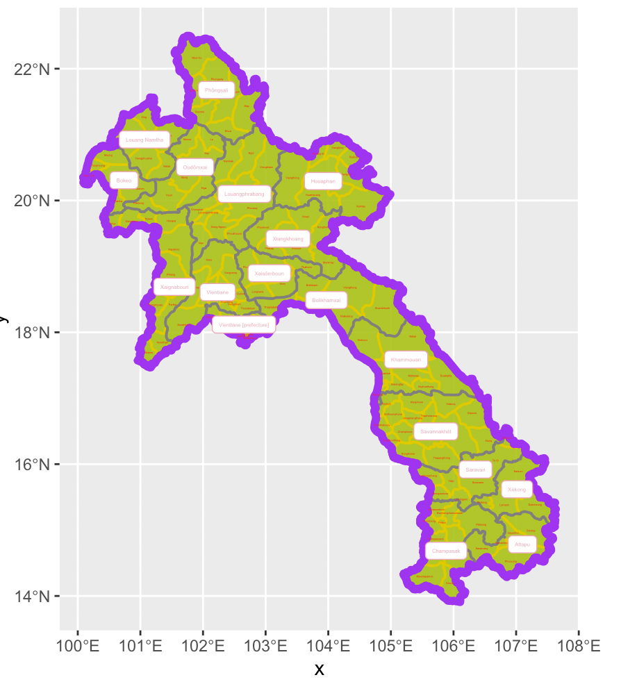
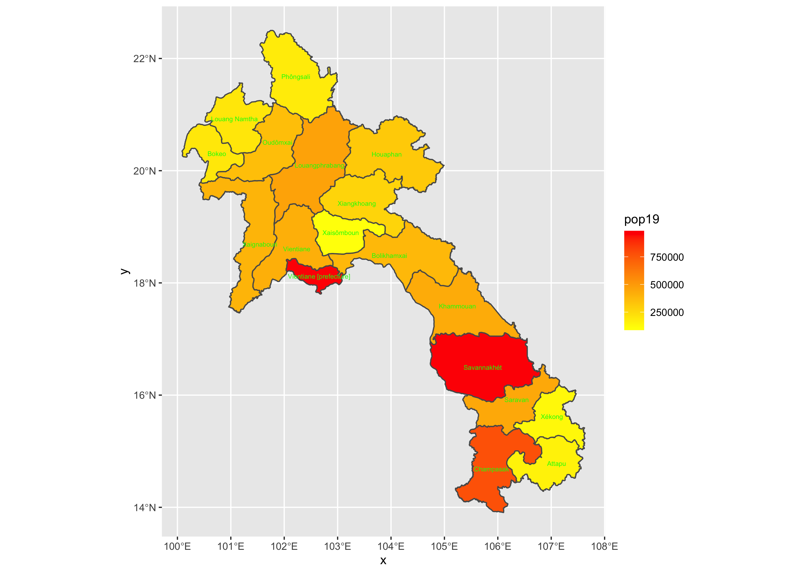
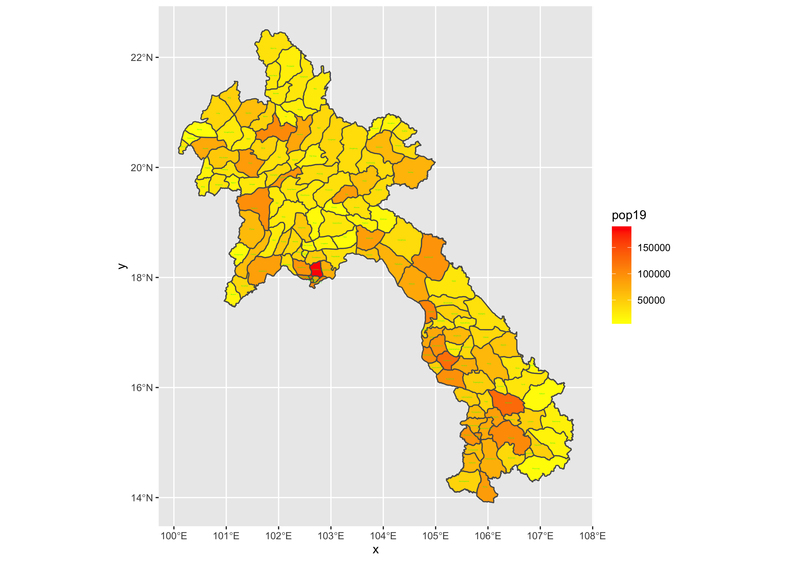

# Introducing myself to you
My name is Haozheng Xu from China and I am a freshman in W&M. Though I havent' been to the campus yet, I really wish to attend classes in person in Williamsburg. I love playing 🏀 , 🏈 , and 🏃. Plus, I intend to major in Finance in W&M but I want to absorb knowledge if Computer Science.

## Picture for 1.4:

###### 

## Challenge Question for 1.4:

###### 

###### Reflection
[Reflection](https://docs.google.com/document/d/1tauA0HOqAXerVZ25IcMBbp21wflgHXanwBNmVY57SaQ/edit)

If the link does not work, the following is also my reflection

Joshua Blumenstock presents a number of promise, pitfalls, and ways forward about how data science defines the general public and helps people in need. Regarding the three statements from my classmates, I would say that transparency is undoubtedly a respect that would enhance the use of data science introduced by Blumenstock; however, good intent is not strictly needed; and balancing act would eventually be reached.

First and foremost, I would be describing promise the author mentions in the article. One example in the article is that people who make international calls frequently or people who have ample access to the Internet tend to be able to pay their debt, essentially, the author means to say that whether one owns a smartphone epitomizes the person’s economic state: people living in areas with Internet and people who can afford Internet expense and international calling expense are typically richer citizens in urban areas, which means they tend to have better jobs and tend to have better chance of paying their debt to the bank. Data science in this respect helps banks and governments find people with the ability to afford payments and locate people who need economic aids.

Regarding the pitfalls the author points out, Blumenstock raises four different aspects, which are unanticipated effects, lack of validation, biased algorithms, and lack of regulation. Unanticipated effects essentially means people allowed to borrow money do not have any idea of what they need to pay back; the second point is that data collection is not authorized and not standardized, which means there is not a standardized rubric that can explain the data collected. An example for this statement would be religious factors that can dramatically affect data collection where a large number of people are travelling; biased algorithm means people who really need help are typically not counted in the data collection; and lastly, data privacy is not guaranteed in most developing countries. For ways forward, there should be more regulation from the government that can protect people’s information privacy, find a better way to help people in need, as well as encouraging scientists and governments to work together for future technological advances.

Considering my classmates’ arguments. I would say that indeed, good intent is not enough in data science since I believe that people need to be driven by profits since one cannot expect people to work hard solely for charity purposes, which is, from my understanding, good intent raised by Raymond: I believe that good intent according to Raymond means that people use data science to truly help the poor. As presented by Adam Smith, the economic market reaches its equilibrium when each party of the market gets its largest profit they could possibly get, as a result, I believe that it is only monetary encouragement or status promotion that can indeed make people self-driven.
Transparency is also essential in the data science use since if there is not transparency, as mentioned also in the passage, people would be using data science for unlawful purposes, people’s information privacy is violated, and in turn, people’s safety is risked. Lastly, regarding the balancing act, I would say that there is still a long way to go, but as long as people are trying, there will eventually be regulations, advanced technology, and intelligent scientists that can help reach the balance.

## Project1
###### 

## Project 2 deliverable
###### 

## Project 2 challenge question
###### 

## Reflection #2
[Reflection #2](https://docs.google.com/document/d/1DzFLnPhPyU8tvknkOEg67XPbEZl87vvTu7mVr3GtTXU/edit)
“Revolutions in science have often been preceded by revolutions in measurement.”
Sinan Aral (cited in Kitchen, 2014) 

In “Big Data, New Epistemologies and Paradigm Shifts” by Rob Kitchen the author emphasizes the importance of measurement as a significant contributing factor for improved description and analysis of complex natural and/or social phenomenon. 

How is the advent of big data serving to advance this revolution in measurement
how is this revolution in measurement serving to elevate data science as an interdisciplinary field of study? 
How is the data deluge advancing a better understanding of human movement, behavior and relationships? 
How does data science contribute towards our improved understanding of human development as a complex and adapting social and economic system?

Big data, as claimed by Pob Kitchen, is one of the most significant factors that is pushing society to proceed. In Kitchen’s article, he points out a few benefits brought by big data to our world: from social science, researches, to interdisciplinary development of human beings. In the following paragraphs, I would be answering the questions raised in the prompt one by one.

First and foremost, big data serving enables the analysts that are measuring to get a wider range of information that could serve to a more comprehensive conclusion. Without big data, collection of information would still stay on polling or censuses, which could be far away from objective and mislead researchers. However, with the presence of big data, as pointed out by Blumenstock (Blumenstock, 2018), the author of our previous reflection, big data allows researchers to find people who are in urgent need of monetary aids through their use of mobile phones and access to electronic devices. Besides, banks and governments can locate citizens that are capable of paying for credits and avoid risks brought by poor clients. Back to the article today, Kitchen cites Dyche’s research where unnoticeable relationships between products are discovered by big data and contribute to enhanced profit rate. In short, big data allows researchers to measure the truth easily instead of measuring a distorted result, which in turn ends up with enhanced evidence that helps decision making.

Regarding big data’s contribution to interdisciplinary researches, as pointed out by Kitchen, big data propels the advancement of data-driven science, an evolved researching methodology that becomes a new paradigm of science. Kitchen’s example is that with big data’s capability to gather valuable and massive data, environmental systems, as an example, are benefited since big data allows for a more vivid simulation of the material world. Were it not big data, one could never imagine that ample information of the past is gathered to help one predict the future: like the way we conclude and estimate rainfall in certain places with massive information from the past. 

Furthermore, about data deluge that is in another article, the author introduces a new argument that correlation is enough. Previous models have been trying to conclude the causation of events, which are proven false nowadays. However, with the presence of correlation, massive data could guarantee that as long as there is a proven relationship, no matter what that is, helps generate valuable information. The article introduces an example of Google where it does not know why one page is better than another, but one just follows the absolutely correct result generated by data. From my perspective, data deluge enables people to put aside any boastful causations assumed by human beings but respect data correlation. Since humans are not objective compared with computers, it is better to believe in what computers tell us.

In conclusion, data science allows people to objectively understand events through cold and solid data, enhances people’s decision making abilities, and helps the society to thrive as a whole. 

[test](Project2.md)
