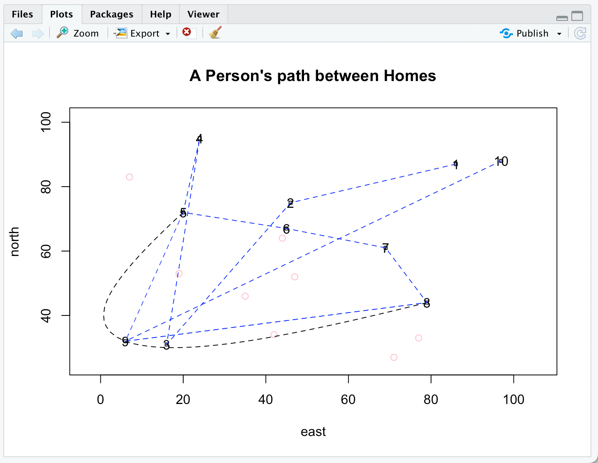
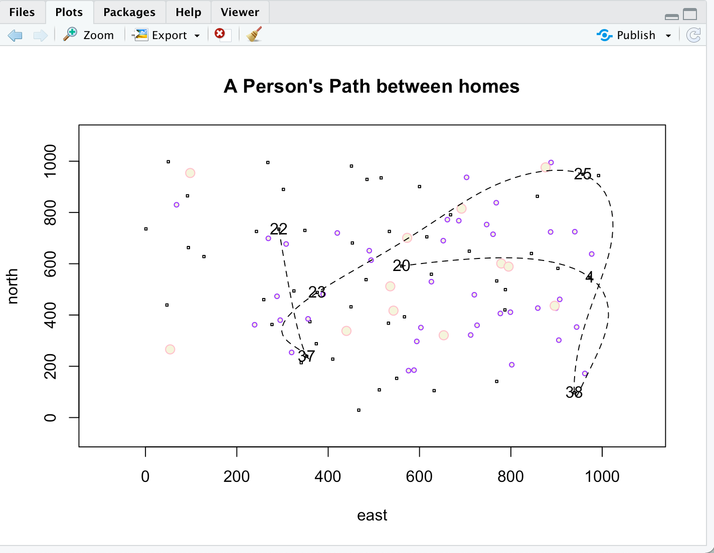

# Introducing myself to you

## My name is Haozheng Xu from China and I am a freshman in W&M. Though I havent' been to the campus yet, I really wish to attend classes in person in Williamsburg. I love playing 🏀 , 🏈 , and 🏃. Plus, I intend to major in Finance in W&M but I want to absorb knowledge if Computer Science.

## Picture for 1.4:

###### 

## Challenge Question for 1.4:

###### 

######[Reflection](https://docs.google.com/document/d/1tauA0HOqAXerVZ25IcMBbp21wflgHXanwBNmVY57SaQ/edit)

If the link does not work, the following is also my reflection

Joshua Blumenstock presents a number of promise, pitfalls, and ways forward about how data science defines the general public and helps people in need. Regarding the three statements from my classmates, I would say that transparency is undoubtedly a respect that would enhance the use of data science introduced by Blumenstock; however, good intent is not strictly needed; and balancing act would eventually be reached.

First and foremost, I would be describing promise the author mentions in the article. One example in the article is that people who make international calls frequently or people who have ample access to the Internet tend to be able to pay their debt, essentially, the author means to say that whether one owns a smartphone epitomizes the person’s economic state: people living in areas with Internet and people who can afford Internet expense and international calling expense are typically richer citizens in urban areas, which means they tend to have better jobs and tend to have better chance of paying their debt to the bank. Data science in this respect helps banks and governments find people with the ability to afford payments and locate people who need economic aids.

Regarding the pitfalls the author points out, Blumenstock raises four different aspects, which are unanticipated effects, lack of validation, biased algorithms, and lack of regulation. Unanticipated effects essentially means people allowed to borrow money do not have any idea of what they need to pay back; the second point is that data collection is not authorized and not standardized, which means there is not a standardized rubric that can explain the data collected. An example for this statement would be religious factors that can dramatically affect data collection where a large number of people are travelling; biased algorithm means people who really need help are typically not counted in the data collection; and lastly, data privacy is not guaranteed in most developing countries. For ways forward, there should be more regulation from the government that can protect people’s information privacy, find a better way to help people in need, as well as encouraging scientists and governments to work together for future technological advances.

Considering my classmates’ arguments. I would say that indeed, good intent is not enough in data science since I believe that people need to be driven by profits since one cannot expect people to work hard solely for charity purposes, which is, from my understanding, good intent raised by Raymond: I believe that good intent according to Raymond means that people use data science to truly help the poor. As presented by Adam Smith, the economic market reaches its equilibrium when each party of the market gets its largest profit they could possibly get, as a result, I believe that it is only monetary encouragement or status promotion that can indeed make people self-driven.
Transparency is also essential in the data science use since if there is not transparency, as mentioned also in the passage, people would be using data science for unlawful purposes, people’s information privacy is violated, and in turn, people’s safety is risked. Lastly, regarding the balancing act, I would say that there is still a long way to go, but as long as people are trying, there will eventually be regulations, advanced technology, and intelligent scientists that can help reach the balance.
