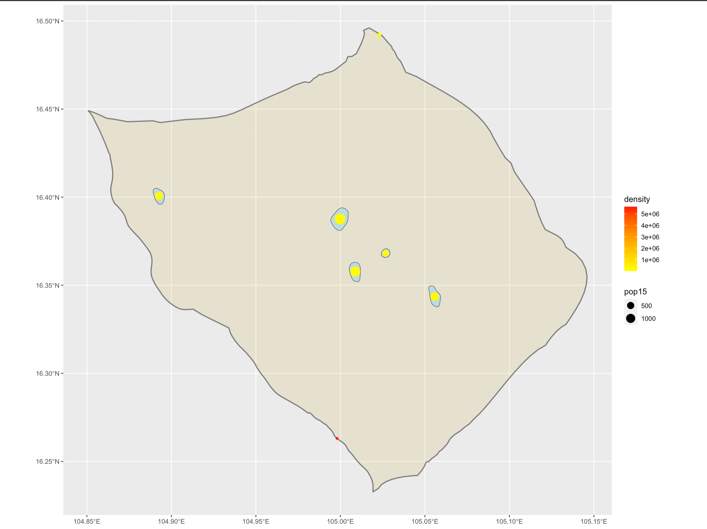
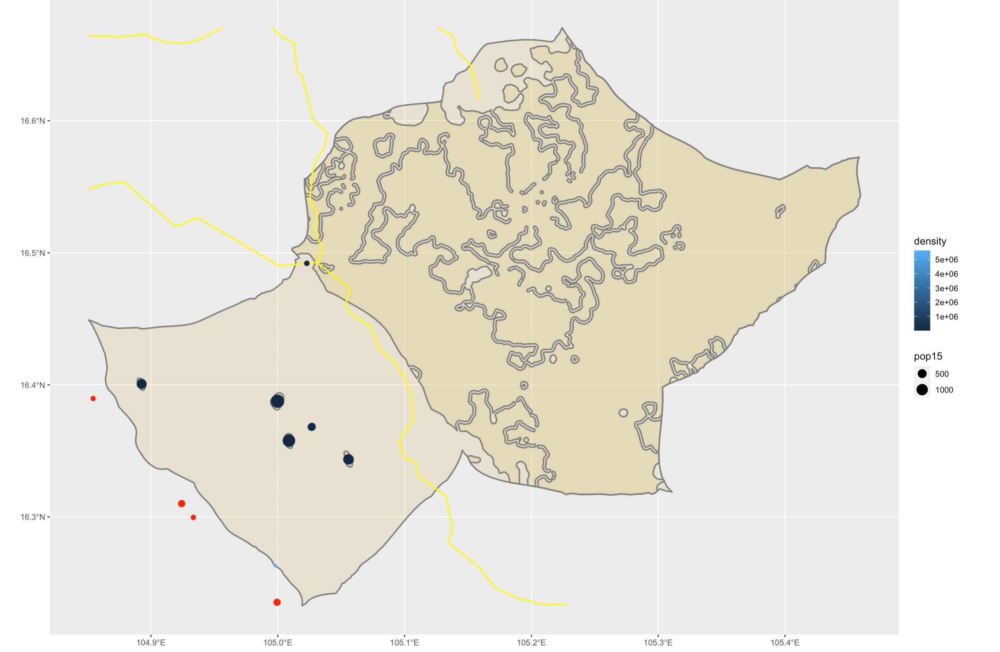
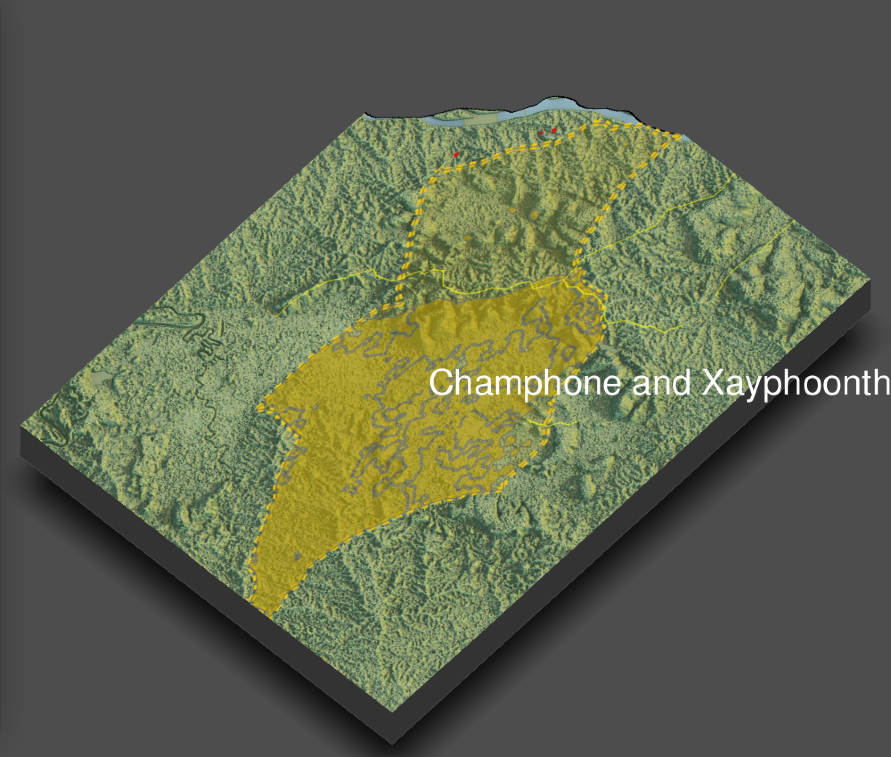

## accessibility1

Because of the place I choose is pretty small, it is actually not urbanized well, so there are not many urban areas.

## accessibility2

## accessibility3

There are a few small red dots at the top of the image, those are the hospitals and clinics in this area (as I said, this place is not quite urbanized).
